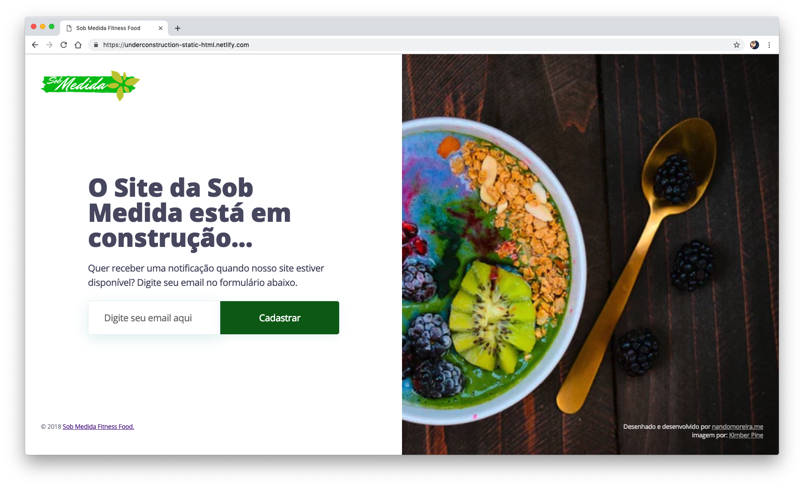

# Sobmedida fitness food [](https://app.netlify.com/sites/underconstruction-static-html/deploys)

## [Demo](https://underconstruction-static-html.netlify.com/)



## Quick start

```bash
$ yarn install # or npm install
$ yarn dev # or npm run dev
```

open [localhost:3000](http://localhost:3000/) in your browser.

## Build mode

```bash
$ yarn build # or npm run build
```

## History

See [Releases](../../releases) for detailed changelog.

## Author

| [](http://twitter.com/oseunando "Follow @oseunando on Twitter") |
| ----------------------------------------------------------------------------------------------------------------------------------------------- |
| [Fernando Moreira](http://twitter.com/oseunando)                                                                                                |

## License

```
WWWWWW||WWWWWW
 W W W||W W W
      ||
    ( OO )__________
     /  |           \
    /o o|    MIT     \
    \___/||_||__||_|| *
         || ||  || ||
        _||_|| _||_||
       (__|__|(__|__|
```

Code is under [MIT License](/LICENSE) - © Fernando Moreira

Enjoy! 😋
